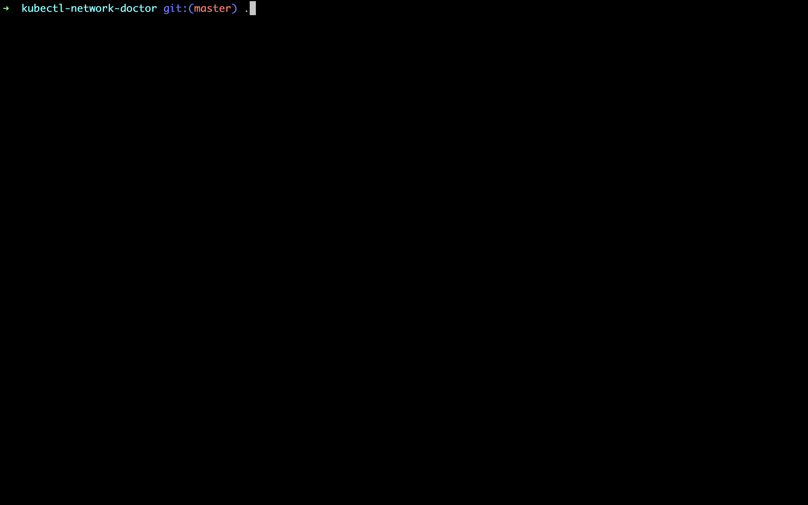

# kubectl network doctor

kubectl network doctor helps you to identify reason of the Kubernetes networking problems like DNS, east-west and south-north traffic communication.

This creates a dump of the network components in Kubernetes cluster.


# Demo

</img>


# INSTALLATION

This plugin has very simple installation method basically you just need to move this script somewhere in the output of the `$PATH` output on your local.

```sh
git clone git@github.com:WoodProgrammer/kubectl-network-doctor.git

pushd kubectl-network-doctor
    chmod +x plugin/kubectl-nd
    mv plugin/kubectl-nd /usr/local/bin
popd

```

# USAGE

This plugin basically gather three argument, one of is name of the  `namespace`, timeout of the `tcpdump` and tcp dump mode `wireshark|stream`.

```sh

    ## kubectl nd <CORE_DNS_NAMESPACE:default:kube-system> <TCP_DUMP_TIMEOUT:default:10> <TCP_DUMP_MODE:default:wireshark>

    kubectl nd kube-system 10 stream
```

Also with this plugin you can test the results of the dns time and traceroute outputs for the specific hosts with the `hosts.txt` file like this;

## Dns and TraceRoute Resolution file

```txt
db.internal.co
ssm.eu-central-1.amazonaws.com
svc.default.cluster.local
svc.ns-test.cluster.local
www.google.com
```

This plugin return this results like this;

```sh

## Map Basically shows <host> <duration-time-period> <resolved-or-not>
{[{www.youtube.com [] 10 false} {www.google.com [] 32 false} {google.com [] 16 false}]}
```

If you use the stream mode this plugin creates pcap files under the `tcpdump-coredns` directory.

Basically you can keep coredns pods tcpdump files as an artifact.

# Concepts and Goals
The problems that covered by this plugin;

* DNS;
    - [x] dns query test optional internal external
    - [x] core-dns logs
    - [x] core-dns healthcheck
    - memory and cpu usage
    - host configuration under these files;
        * /etc/hosts
        * /etc/resolv.conf
        * nsswitch.conf

* TCP/IP
    - [x] Pcap dump 
    - [x] traceroute outputs
    - Direct analysis based on bpf rules.

* TODO
    * pod-to-pod communication (based on topology keys or labels)
    * node-to-node communication
    * node network configuration


# RoadMap

We will provide command line flags and other user friendly options to this plugin.

# Related Links;

<a href="https://www.wireshark.org/">WireShark Installation </a>
